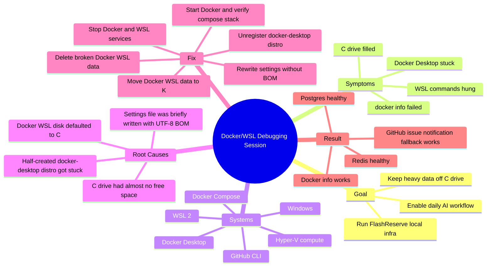
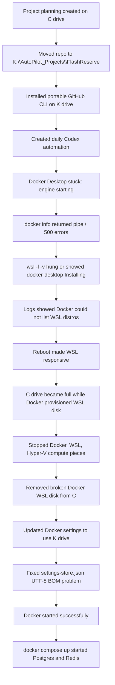

# Learning Note: Docker, WSL, Disk Space, And Project Automation

Date: 2026-06-29  
Session window: from midnight to this note  
Project workspace: `K:\AutoPilot_Projects\FlashReserve`  
Branch: `codex/flashreserve-docker-compose`  
Related GitHub issue: https://github.com/krishna-057/architecture-lab/issues/1

## Visual Context

Screenshot from the session:


Official references used:

- Docker Desktop WSL 2 backend docs: https://docs.docker.com/desktop/features/wsl/
- Docker Desktop Windows install data-root options: https://docs.docker.com/desktop/setup/install/windows-install/
- Microsoft WSL basic commands: https://learn.microsoft.com/en-us/windows/wsl/basic-commands
- Microsoft WSL container tutorial: https://learn.microsoft.com/en-us/windows/wsl/tutorials/wsl-containers

## Mind Map



## Timeline



## 1. Problem Summary

We were setting up a 30-day full-stack project lab where an AI agent can work daily, push to GitHub, and notify you when human input is needed.

The immediate technical problem was Docker Desktop on Windows. Docker was expected to start a Linux-based engine so that we could run local development services for FlashReserve:

- PostgreSQL on port `5432`
- Redis on port `6379`

Instead, Docker Desktop got stuck at engine startup. Commands such as:

```powershell
docker info
```

failed with errors like:

```text
open //./pipe/dockerDesktopLinuxEngine: The system cannot find the file specified
```

and earlier:

```text
request returned 500 Internal Server Error for ... dockerDesktopLinuxEngine
```

This meant the Docker command-line client existed, but the Docker engine behind it was not actually ready.

The visible behavior:

- Docker Desktop UI showed the engine starting.
- `docker info` could not talk to the Docker engine.
- `wsl -l -v` initially hung.
- Later, WSL showed `docker-desktop` stuck in `Installing`.
- The `C:` drive filled up while Docker tried to create its WSL disk.

The expected behavior:

- Docker Desktop starts.
- WSL shows `docker-desktop` as `Running`.
- `docker info` prints server details.
- `docker compose up -d` starts Postgres and Redis.

Final result:

- Docker was reset.
- Docker WSL data was moved to `K:\AutoPilot_Projects\docker-data\wsl`.
- `docker info` worked.
- FlashReserve's local Postgres and Redis containers became healthy.

## 2. Context

### Project context

The project is a full-stack architecture portfolio lab:

```text
K:\AutoPilot_Projects\FlashReserve
```

The active project is FlashReserve, a flash-sale reservation system. It needs:

- PostgreSQL for durable business data.
- Redis for fast reservation counters and queues.
- Docker Compose to run local infrastructure reproducibly.

Important repo files:

```text
MASTER_PLAN.md
WORKFLOW.md
NOTIFICATIONS.md
ENVIRONMENT_STATUS.md
projects/01-flashreserve/compose.yaml
```

### Tools involved

| Tool | Role |
| --- | --- |
| Windows | Host operating system. |
| PowerShell | Command shell used for debugging. |
| WSL 2 | Runs a lightweight Linux environment inside Windows. |
| Docker Desktop | Provides Docker engine on Windows using WSL 2. |
| Docker CLI | The `docker` command used to talk to Docker engine. |
| Docker Compose | Starts multiple containers from `compose.yaml`. |
| Hyper-V Host Compute Service | Windows virtualization service used by WSL/Docker. |
| Git | Version control. |
| GitHub CLI | GitHub issue/PR/auth helper installed portably on K. |

### Docker Compose file

The FlashReserve compose file defines two services:

```yaml
services:
  postgres:
    image: postgres:17-alpine
    ports:
      - "${FLASHRESERVE_POSTGRES_PORT:-5432}:5432"

  redis:
    image: redis:7.4-alpine
    ports:
      - "${FLASHRESERVE_REDIS_PORT:-6379}:6379"
```

This means:

- The app can connect to Postgres on `localhost:5432`.
- The app can connect to Redis on `localhost:6379`.
- Docker downloads images and stores them in Docker's internal data disk.

## 3. Root Cause

The main root cause was disk location plus low free space.

Docker Desktop on Windows uses WSL 2. Docker's official docs say that by default Docker Desktop stores WSL 2 engine data under:

```text
C:\Users\[USERNAME]\AppData\Local\Docker\wsl
```

On this machine, the `C:` drive had extremely little free space. Docker tried to provision its internal WSL distribution there:

```text
C:\Users\91600\AppData\Local\Docker\wsl\disk\docker_data.vhdx
C:\Users\91600\AppData\Local\Docker\wsl\main\ext4.vhdx
```

These `.vhdx` files are virtual hard disks. They are files on Windows, but WSL treats them like Linux disks.

The chain of failure was:

1. Docker Desktop tried to create or repair its `docker-desktop` WSL distro.
2. It wrote large WSL disk files on `C:`.
3. `C:` became full.
4. Docker's WSL distro was left half-created.
5. WSL commands started hanging or showed `docker-desktop` as `Installing`.
6. Docker CLI could not find or talk to the engine pipe.
7. Docker Desktop reported no connected VM or failed WSL provisioning.

There was also a temporary secondary issue caused during the fix:

```text
formatting settings-store.json: invalid character 'ï' looking for beginning of value
```

That happened because a PowerShell write operation saved Docker's JSON settings file with a UTF-8 byte order mark, also called a BOM. Docker expected the JSON file to start directly with `{`, but it saw invisible BOM bytes first. We fixed this by rewriting the file as UTF-8 without BOM.

## 4. How You Investigated It

### Command: `docker version`

```powershell
docker version
```

What it does:

- Prints Docker client and server versions.
- The client is the command-line tool.
- The server is the Docker engine.

Why used:

- To check whether Docker CLI was installed and whether the engine was reachable.

Expected output:

- Client version and Server version.

Actual output:

```text
Client: Version 28.1.1
Server: ERROR ...
```

Meaning:

- The Docker command existed.
- The Docker engine was broken or unreachable.

### Command: `docker info`

```powershell
docker info
```

What it does:

- Shows detailed Docker server status, storage driver, containers, images, memory, CPU, and runtime information.

Why used:

- This is the standard health check for Docker engine.

Expected output:

- Server details such as `Containers`, `Images`, `Server Version`, and `Docker Root Dir`.

Actual failure:

```text
open //./pipe/dockerDesktopLinuxEngine: The system cannot find the file specified
```

Meaning:

- Docker CLI tried to connect to a Windows named pipe.
- That pipe did not exist because Docker's Linux engine had not started.

### Command: `wsl -l -v`

```powershell
wsl -l -v
```

What it does:

- Lists installed WSL distributions.
- `-l` means list.
- `-v` means show version and state.

Why used:

- Docker Desktop uses a WSL distribution named `docker-desktop`.

Expected output:

```text
NAME              STATE      VERSION
docker-desktop    Running    2
```

Actual outputs during the session:

```text
docker-desktop    Installing    2
```

and sometimes the command hung.

Meaning:

- WSL itself was struggling.
- Docker's WSL distro was not fully provisioned.

### Command: `Get-PSDrive`

```powershell
Get-PSDrive -PSProvider FileSystem | Select-Object Name,Free,Used,Root
```

What it does:

- Lists Windows drives and their free/used space.
- `-PSProvider FileSystem` limits the result to real filesystem drives.
- `Select-Object` chooses only the columns we care about.

Why used:

- The user warned that `C:` had very little space.
- Docker stores large image/container data.

Expected output:

- Enough free space on the target drive.

Actual key output:

```text
C: Free = 0 bytes
K: Free = about 203 GB
```

Meaning:

- Docker could not safely keep provisioning on `C:`.
- Heavy data needed to move to `K:`.

### Command: `Get-Service`

```powershell
Get-Service com.docker.service,LxssManager,vmcompute
```

What it does:

- Shows Windows service status.

Important services:

- `com.docker.service`: Docker Desktop service.
- `LxssManager`: Windows service that manages WSL.
- `vmcompute`: Hyper-V Host Compute Service.

Why used:

- Docker Desktop depends on Windows services and WSL virtualization.

Actual findings:

- At different times, Docker or WSL services were stopped, hung, or needed restarting.

### Command: `Get-Process`

```powershell
Get-Process | Where-Object { $_.ProcessName -match 'Docker|com\.docker|wsl|vmmem' }
```

What it does:

- Lists running processes.
- `Where-Object` filters the list.
- `-match` uses a regular expression.

Why used:

- Some services were stopped, but process objects like `vmmemWSL` and `vmwp` still existed.

Important processes:

- `vmmemWSL`: memory process for a running WSL VM.
- `vmwp`: virtual machine worker process.
- `vmcompute`: virtualization management process.

What output told us:

- The Docker/WSL VM was still holding files open.
- The `.vhdx` files could not be deleted until these processes stopped.

### Command: `Get-Content -Tail`

```powershell
Get-Content -Tail 180 "$env:LOCALAPPDATA\Docker\log\host\com.docker.backend.exe.log"
```

What it does:

- Reads the last lines of a file.
- `-Tail 180` means show only the last 180 lines.
- `$env:LOCALAPPDATA` is an environment variable pointing to the user's local app data folder.

Why used:

- Logs explain why Docker Desktop failed internally.

Important errors found:

```text
listing WSL distros: running WSL command wsl.exe ... context deadline exceeded
```

```text
no connected VM
```

```text
invalid character 'ï' looking for beginning of value
```

What these told us:

- Docker was blocked while talking to WSL.
- The VM was not connected to Docker's backend.
- Later, Docker's settings JSON had an encoding problem.

### Command: `wsl --unregister docker-desktop`

```powershell
wsl --unregister docker-desktop
```

What it does:

- Removes a WSL distribution completely.
- Microsoft documents this as a way to remove a distro and all associated data.

Important warning:

- This deletes that WSL distro's data.

Why used:

- The `docker-desktop` distro was broken and half-provisioned.
- The project data was not inside that distro.
- Resetting only Docker's distro was safer than reinstalling the whole OS or deleting project files.

Actual output:

```text
The operation completed successfully.
```

Meaning:

- The broken Docker WSL registration was removed.

### Command: `docker compose -f ... up -d`

```powershell
docker compose -f projects\01-flashreserve\compose.yaml up -d
```

What it does:

- Starts services defined in a Compose file.
- `compose` is Docker's multi-container tool.
- `-f` points to a specific compose file.
- `up` creates/starts services.
- `-d` means detached mode, so containers run in the background.

Why used:

- To verify Docker was truly working, not merely starting.

Expected output:

- Docker pulls images and starts containers.

Actual output:

- Docker pulled `postgres:17-alpine` and `redis:7.4-alpine`.
- It created and started containers.

### Command: `docker compose ... ps`

```powershell
docker compose -f projects\01-flashreserve\compose.yaml ps
```

What it does:

- Shows status of Compose services.

Expected output:

- Postgres and Redis should be `healthy`.

Actual final output:

```text
flashreserve-local-postgres-1   Up ... (healthy)
flashreserve-local-redis-1      Up ... (healthy)
```

Meaning:

- The fix worked.
- Local infrastructure is ready for the project.

## 5. The Fix

The fix had several parts.

### Part 1: Move work off C drive

The repo was moved to:

```text
K:\AutoPilot_Projects\FlashReserve
```

NPM cache was moved to:

```text
K:\AutoPilot_Projects\npm-cache
```

GitHub CLI was installed portably at:

```text
K:\AutoPilot_Projects\tools\gh\gh.exe
```

Why:

- `C:` had very little space.
- Project dependencies and Docker images can consume gigabytes.

### Part 2: Reset broken Docker WSL data

The broken Docker WSL data on `C:` was removed:

```text
C:\Users\91600\AppData\Local\Docker\wsl
```

The stale Docker WSL distro was unregistered:

```powershell
wsl --unregister docker-desktop
```

Why:

- Docker's internal Linux environment was half-created and stuck.

### Part 3: Point Docker data to K drive

Docker settings were changed to:

```text
CustomWslDistroDir = K:\AutoPilot_Projects\docker-data\wsl
DataFolder = K:\AutoPilot_Projects\docker-data\vm-data
```

Why:

- Docker's large internal disks should live on the large drive.

### Part 4: Fix JSON encoding

PowerShell initially wrote `settings-store.json` with a UTF-8 BOM. Docker rejected it.

The file was rewritten using UTF-8 without BOM.

Why:

- JSON parsers often expect the first meaningful byte to be `{`.
- Invisible encoding bytes can break strict parsers.

### Part 5: Verify with real services

We did not stop at "Docker opened." We verified by running:

```powershell
docker info
docker compose -f projects\01-flashreserve\compose.yaml up -d
docker compose -f projects\01-flashreserve\compose.yaml ps
```

This proved:

- Docker engine works.
- Docker can pull images.
- Docker can create containers.
- PostgreSQL and Redis can become healthy.

## 6. Fundamental Concepts

### Files and paths

A path is an address for a file or folder.

Examples:

```text
C:\Users\91600\AppData\Local\Docker\wsl
K:\AutoPilot_Projects\FlashReserve
```

On Windows:

- `C:` and `K:` are drives.
- Backslashes separate folders.
- `AppData` stores application-specific user data.

Why it mattered:

- Docker's default path was on the nearly-full `C:` drive.
- Moving paths to `K:` gave Docker enough storage.

### Environment variables

An environment variable is a named value available to programs.

Example:

```powershell
$env:LOCALAPPDATA
```

This expands to something like:

```text
C:\Users\91600\AppData\Local
```

Why it mattered:

- Docker logs and data were located using environment variables.

### Processes

A process is a running program.

Examples from the session:

- `Docker Desktop`
- `com.docker.backend`
- `wslservice`
- `vmmemWSL`
- `vmwp`

Why it mattered:

- A file cannot always be deleted if a process is using it.
- The Docker `.vhdx` file stayed locked until WSL/VM processes were stopped.

### Services

A Windows service is a background program managed by Windows.

Examples:

- `LxssManager`: manages WSL.
- `vmcompute`: manages virtualized compute.
- `com.docker.service`: Docker Desktop service.

Why it mattered:

- Restarting or stopping these services can reset stuck virtualization layers.

### Docker client vs Docker engine

Docker has two main parts:

```text
docker CLI  --->  Docker engine
```

The CLI is the command you type.
The engine is the background server that creates containers.

Our problem:

- The CLI existed.
- The engine was not ready.

That is why `docker --version` or client info worked, but `docker info` failed at the server section.

### Docker Compose

Docker Compose starts multiple containers from one file.

In our project:

- Postgres is one container.
- Redis is one container.
- The network connects them.
- Healthchecks verify they are ready.

### Virtual disks

A `.vhdx` file is a virtual hard disk.

It is a normal Windows file, but WSL/Docker treats it like a Linux disk.

Why it mattered:

- Docker images and containers were stored inside `.vhdx` files.
- Those files grew on `C:`.
- When `C:` filled, Docker could not finish.

### Encoding and BOM

Text files are bytes. Encoding tells programs how to interpret those bytes.

UTF-8 BOM means the file starts with special invisible bytes:

```text
EF BB BF
```

Some parsers accept this. Some strict JSON readers do not.

Docker rejected the settings file until it was rewritten without BOM.

## 7. Hardware or System-Level Explanation

### Disk storage

The disk stores files permanently.

Docker uses disk for:

- Images
- Containers
- Volumes
- WSL virtual disks

What went wrong:

- `C:` was almost full.
- Docker tried to create large disk files there.
- The operating system could not give Docker enough space.

How to diagnose:

```powershell
Get-PSDrive C,K
```

### RAM

WSL uses memory through a process like:

```text
vmmemWSL
```

This represents memory used by the Linux VM.

What can go wrong:

- A stuck VM can keep files locked.
- Restarting WSL or VM services may be needed.

### CPU and virtualization

WSL 2 uses virtualization. Windows runs a lightweight Linux VM behind the scenes.

Components involved:

- Hyper-V Host Compute Service
- WSL service
- VM worker process

Docker Desktop talks to that Linux VM to run Linux containers.

If the VM layer is stuck, Docker cannot create or inspect containers.

### Networking

Once Docker worked, ports were exposed:

```text
localhost:5432 -> Postgres
localhost:6379 -> Redis
```

This means Windows programs can connect to services running inside containers.

## 8. Why This Error Happens In General

This class of error often happens when the command-line tool exists but the background service is broken.

Examples:

### Docker installed but engine down

```text
Cannot connect to Docker daemon
```

Cause:

- Docker Desktop not started.
- Engine crashed.
- WSL backend broken.

### Disk full during setup

Symptoms:

- Installers fail.
- Services half-install.
- Large cache files corrupt or stop growing.

Cause:

- Not enough space for downloads, extraction, or virtual disks.

### WSL distro stuck

Symptoms:

```text
wsl -l -v
```

hangs or shows a distro stuck in `Installing`.

Cause:

- Broken provisioning.
- Locked virtual disk.
- Interrupted install.

### JSON config file invalid

Symptoms:

```text
invalid character ... looking for beginning of value
```

Cause:

- Bad encoding.
- Extra invisible bytes.
- Corrupted file.
- Manual edit mistake.

## 9. How It Affects The System

If Docker is broken:

- You cannot run local databases.
- Backend development slows down.
- Tests depending on Postgres/Redis fail.
- Automation cannot verify infrastructure.
- Future project scaffolding becomes unreliable.

If `C:` stays full:

- Installers fail.
- Windows updates may fail.
- App caches may corrupt.
- Tools like Docker, GitHub CLI, Node, and browsers may behave unpredictably.

If WSL is stuck:

- Docker's Linux containers fail.
- WSL commands hang.
- Virtual disk files may stay locked.
- Restarting Docker alone may not fix it.

## 10. How To Be Careful Next Time

### Storage habits

Keep heavy project data on `K:`:

```text
K:\AutoPilot_Projects
```

Avoid putting these on `C:`:

- `node_modules`
- Docker images
- Python virtual environments
- AI model files
- Generated videos/images
- Large datasets

### Check free space first

Before installing heavy tools:

```powershell
Get-PSDrive C,K
```

### Check Docker health

Use:

```powershell
docker info
```

Do not trust only the Docker Desktop UI. The CLI tells you whether the engine really works.

### Check WSL health

Use:

```powershell
wsl -l -v
```

If it hangs, suspect WSL or virtualization, not your application code.

### Read logs

Docker logs are often under:

```text
C:\Users\91600\AppData\Local\Docker\log\host
```

Read recent backend logs:

```powershell
Get-Content -Tail 200 "$env:LOCALAPPDATA\Docker\log\host\com.docker.backend.exe.log"
```

### Use version control

We committed changes in small steps:

```text
Initialize architecture lab plan
flashreserve: add local docker compose stack
Add GitHub issue notification fallback
Document Docker storage on K drive
```

This makes it easier to understand what changed and when.

### Avoid encoding mistakes

When editing config files programmatically, be careful with encodings.

For strict config files like JSON:

- Avoid accidental BOM.
- Validate the file after writing.
- Keep backups before modifying app settings.

## 11. Mental Model

Think of Docker Desktop on Windows as a restaurant with three layers:

```text
You place an order: docker CLI
Kitchen manager: Docker Desktop backend
Kitchen building: WSL Linux VM
Storage room: Docker virtual disk on Windows
```

In this session, the waiter existed, but the kitchen was not ready.

At first, the kitchen building was stuck being constructed. Then the storage room filled up. Then the manager's instruction sheet briefly had invisible bad characters at the start.

The fix was:

1. Stop the broken kitchen construction.
2. Clear the bad half-built storage.
3. Move the storage room to a bigger building on `K:`.
4. Rewrite the instruction sheet cleanly.
5. Start the kitchen again.
6. Cook a real test meal: Postgres and Redis.

## 12. Step-By-Step Beginner Explanation

We wanted to run backend services for a project. Backend services are programs that help the app, such as databases and caches.

For FlashReserve, we need:

- PostgreSQL: stores important data like users, products, reservations, and orders.
- Redis: stores fast temporary data like reservation counters.

Instead of installing PostgreSQL and Redis manually, we use Docker. Docker lets us run software inside containers. A container is like a small isolated environment for one program.

On Windows, Docker Desktop often uses WSL 2. WSL 2 lets Windows run a real Linux environment. Docker uses that Linux environment because most containers are Linux containers.

When Docker started, it tried to create its internal Linux environment. That environment is called `docker-desktop`. Docker stores it inside virtual disk files ending in `.vhdx`.

The problem was that Docker created those virtual disk files on `C:`, but `C:` was almost full.

When the disk filled up, Docker could not finish creating its internal Linux environment. That left WSL in a confusing state. Sometimes WSL said Docker was still installing. Sometimes WSL commands hung. Docker CLI then failed because there was no working Docker engine to talk to.

We investigated by checking:

1. Whether Docker CLI existed.
2. Whether Docker engine responded.
3. Whether WSL listed Docker's distro.
4. Whether Windows had enough disk space.
5. What Docker logs said.
6. Which processes were locking Docker's disk files.

Once we understood that the broken data was Docker's internal WSL data, not the project code, we safely reset it.

We stopped Docker and WSL services. We deleted Docker's broken WSL disk files from `C:`. We unregistered the broken `docker-desktop` WSL distro. Then we changed Docker settings so Docker would create its WSL disks on:

```text
K:\AutoPilot_Projects\docker-data\wsl
```

There was one extra problem: Docker's settings file was accidentally saved in an encoding Docker did not like. We rewrote it without those invisible starting bytes.

Then Docker started correctly. We verified it with:

```powershell
docker info
```

Finally, we ran:

```powershell
docker compose -f projects\01-flashreserve\compose.yaml up -d
```

This downloaded Postgres and Redis images and started containers. Then:

```powershell
docker compose -f projects\01-flashreserve\compose.yaml ps
```

showed both services as healthy.

That means Docker is now ready for the next stage of FlashReserve development.

## 13. Key Takeaways

- Docker CLI and Docker engine are different. The CLI can exist even when the engine is broken.
- On Windows, Docker Desktop often depends on WSL 2.
- WSL distros use virtual disk files such as `.vhdx`.
- Docker's WSL data defaults to the user profile on `C:` unless configured otherwise.
- A full disk can create confusing failures that look like software bugs.
- `docker info` is a strong Docker health check.
- `wsl -l -v` is a strong WSL health check.
- Logs are not scary; they are the system explaining where it got stuck.
- `wsl --unregister <distro>` is powerful and destructive, so use it only when you know the distro can be safely recreated.
- Config file encoding matters. Invisible bytes can break parsers.
- The best fix is not just "make the error go away"; it is to verify with a real workflow.
- We verified the fix by running actual Postgres and Redis containers successfully.

